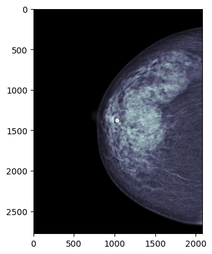
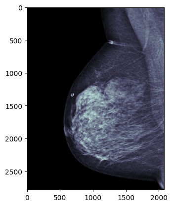

# RSNA Screening Mammography Breast Cancer Detection

[Kaggle dataset](https://www.kaggle.com/competitions/rsna-breast-cancer-detection/data)

|||
|--|--|
|Task|Breast cancer detection|
|Datatype|mammogram images|
|Classes|2 (yes/no): Whether or not the breast was positive for malignant cancer.|
|Samples|54,706 from 11,913 patients|
|Sample shape|from 2,776 x 2,082 (3.5MB, 5.78 megapixels) to 3,328 x 2,560 (3 - 7MB, 8.52 megapixels)|
|Sample notes|distributed across 2 sites<ul><li>29,519 images from 5,818 patients <li>25,187 images from 6,095 patients</ul>248 cancerous patients|
|Model|Actually, a lot of preprocessing ... ([see here](https://www.kaggle.com/competitions/rsna-breast-cancer-detection/leaderboard))|

## Examples

